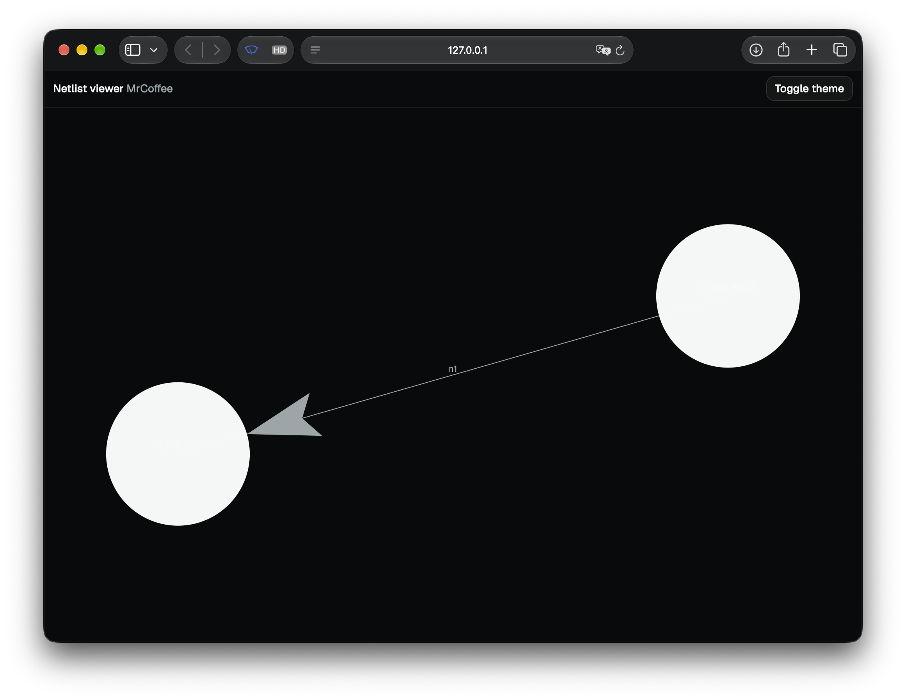

# Netlist Viewer Exercise

This project was derived from the noRTL Live Viewer to serve as a minimal example. It includes a programming task, without being overly complicated.

The project is meant to visualize a Verilog netlist inside a [force-graph](https://github.com/vasturiano/force-graph) canvas.
The netlist was synthesized from the ["Mr. Coffee" example](https://imms-ilmenau.github.io/nortl/tutorial/00_first_engine/) via [yosys](https://yosyshq.readthedocs.io/en/latest/).

The project shares (most of) the build stack as the noRTL Viewer:

- [esbuild](https://esbuild.github.io) for building and bundling into a single-page application
- React 19 with [React Router](https://reactrouter.com).
- [Tailwind CSS](https://tailwindcss.com)
- [React Aria](https://react-aria.adobe.com) components (currently, just one button is added) and [shadcn](https://ui.shadcn.com) for styling.

The noRTL Viewer also uses a mixture of [zustand](https://zustand.docs.pmnd.rs) and some manual implementations for state management. These are omitted for this project.

## The Task

The force-graph canvas is already mounted in `src/pages/graph.tsx`.
However, it currently only draws two hardcoded instances and one wire, as shown below:



The synthesized netlist is included as a JSON object in `src/netlist/MrCoffee.json`. The `graph.tsx` page already imports it, and esbuild burns the object into `app.js`, so you don't need to care about uploading the JSON.

Your task is to replace the hardcoded graph with one based on the imported netlist.
You will probably not need to touch any other files. You may move the graph processing into a new module, if you like.

## Building and Serving

The project can be served using esbuild with the following two commands:

```bash
npm install
npm run serve
```

Open [http://127.0.0.1:8082](http://127.0.0.1:8082). The dev server automatically rebuilds on changes and reloads the page.

In addition, there are commands for typechecking and building as a final product (this step is of course not required).

```bash
npm run typecheck
npm run build
```
