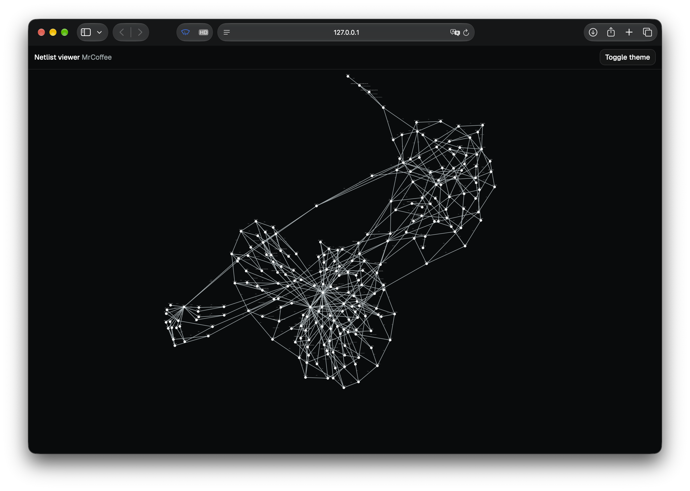

# Netlist Viewer Exercise

This project was derived from the noRTL Live Viewer to serve as a minimal example. It includes a programming task, that is related to the viewer, without being overly complicated.

The project is meant to visualize a Verilog netlist inside a [force-graph](https://github.com/vasturiano/force-graph) canvas.
The netlist was synthesized from the ["Mr. Coffee" example](https://imms-ilmenau.github.io/nortl/tutorial/00_first_engine/) via [Yosys](https://yosyshq.readthedocs.io/en/latest/).

The project shares (most of) the build stack as the noRTL Viewer:

- [esbuild](https://esbuild.github.io) for building and bundling into a single-page application
- React 19 with [React Router](https://reactrouter.com).
- [Tailwind CSS](https://tailwindcss.com)
- [React Aria](https://react-aria.adobe.com) components (currently, just one button is added) and [shadcn](https://ui.shadcn.com) for styling.

The noRTL Viewer also uses a mixture of [zustand](https://zustand.docs.pmnd.rs) and some manual implementations for state management. These are omitted for this project.

## The Task

The force-graph canvas is already mounted in `src/pages/graph.tsx`.
However, it currently only draws two hardcoded instances and one wire, as shown below:


The synthesized netlist is included as a JSON object in `src/netlist/MrCoffee_flat.json`. The `graph.tsx` page already imports it, and esbuild burns the object into `app.js`, so you don't need to care about uploading the JSON.

Your task is to replace the hardcoded graph with one based on the imported netlist.
You will probably not need to touch any other files. You may move the graph processing into a new module, if you like.

The result should look similar to this:



It should show all **instances** inside the top module as **nodes** and the **nets** connecting them as **links**.
As the JSON format is relatively closely based on the output of Yosys, you need to find out how to create the list of nodes and links from the JSON.

## Building and Serving

The project can be served using esbuild with the following two commands:

```bash
npm install
npm run serve
```

Open [http://127.0.0.1:8082](http://127.0.0.1:8082). The dev server automatically rebuilds on changes and reloads the page.

In addition, there are commands for typechecking and building as a final product (this step is of course not required).

```bash
npm run typecheck
npm run build
```

## JSON Schema

The JSON files have the following schema, when represented as Typescript interfaces. You can also find HTML documentation in `docs/netlist-schema.html`.

```ts 
export type Direction = "input" | "output" | "inout";

export interface Netlist {
  format: "netlist-viewer";
  version: 1;
  top: string;

  // List of modules
  modules: Module[];

  // Mapping of library cells to their pin lists
  library: Record<string, Pin[]>;
}

// Design module
export interface Module {
  name: string;
  // List of external ports
  ports: Port[];
  // List of internal wires
  wires: Wire[];
  // List of module or library cell instances
  instances: Instance[];
}

// Instance of a module or library cell
export interface Instance {
  name: string;
  // Name of module or library cell
  type: string;
  // Binding of ports/pins to net names (not wires!)
  connections: Record<string, string[]>;
  // Parameters, unused
  parameters?: Record<string, string>;
}

// External connection of modules (1 or more bits)
export interface Port {
  name: string;
  direction: Direction;
  // One net name per bit, least significant bit first.
  nets: string[];
}

// Internal connection of modules (1 or more bits)
export interface Wire {
  name: string;
  // One net name per bit, least significant bit first.
  nets: string[];
}

// External connection of library cells (1 bit)
export interface Pin {
  name: string;
  direction: Direction;
}
```

# Hints

- For the current representation, **wires** can be fully ignored. They bundle one or more **nets** into multi-bit signals.
    However, instance connections also use individual **nets** to connect the ports, so wires don't matter.
- Input and output **ports** of the toplevel module would not appear in the graph, because they typically only connect to either input or output ports of instances inside the module.
    For example, the `CLK_I` clock input pin will most likely only go to clock inputs of flipflops, but never to any output.
    You may visualisize the input and output ports as **nodes** in the graph, alongside the nodes of the **instances**.
- Constant net assignments `const:0`/`cont:1` have no driving cell. You can ignore them.
- `CLK_I` and `RST_ASYNC_I` reach almost every flip-flop. You may ignore them in the graph, otherwise, it will be clustered together. 
- Skip links whose two ends are the same cell (e.g. a loop from `Q` to `D` on flipflops), if the occur.

# Ideas

- Color input and output **port nodes** differently.
- Add an optional switch button, that hides or shows `CLK_I` and `RST_ASYNC_I`.
